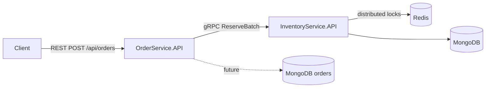
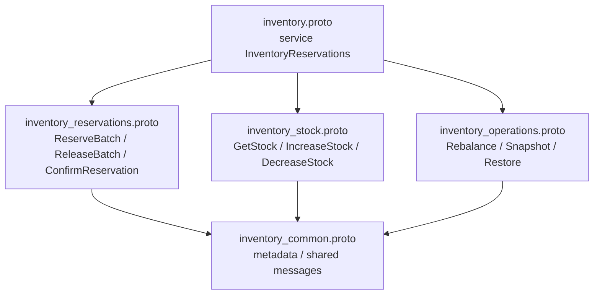

# Inventory Reservation System

Inventory Reservation System is an early-stage .NET microservice prototype for reserving stock for orders.

Goal: keep order management and inventory reservation separate, then connect them through gRPC. MongoDB collection schemas, technical logging, Redis distributed lock infrastructure, stock lookup, and real ReserveBatch reservation behavior are in place. Release, confirm, expiry, idempotency, and operational reservation workflows are still in progress.

## Current status

- Phase: early infrastructure/prototype.
- Two API services exist: `OrderService.API` and `InventoryService.API`.
- Shared gRPC contract project exists and generates C# stubs from physically split proto files under `src/contracts/InventoryReservationSystem.Contracts/Protos`.
- `OrderService.API` exposes a minimal order creation endpoint and calls `InventoryService.API` over gRPC.
- `InventoryService.API` exposes a gRPC service; `GetStock(sku, warehouseId?)` and `ReserveBatch(items[])` are wired to Application and MongoDB, while release, confirm, and operational methods still use placeholder responses.
- InventoryService initializes MongoDB schemas for `InventoryItems`, `Reservations`, and `InventoryTransactions` with validation rules and indexes.
- InventoryService has Redis distributed lock infrastructure with deterministic lock ordering, Polly retry, lock TTL, safe token-based release, and structured Serilog lock logs.
- InventoryService writes technical logs through Serilog to console and MongoDB `ApplicationLogs`.
- .NET Aspire AppHost exists for API orchestration only.
- Docker Compose exists for both APIs, MongoDB replica-set startup, Redis, and RedisInsight.
- ServiceDefaults provides shared OpenTelemetry configuration, gRPC client instrumentation, service discovery, HTTP resilience defaults, CorrelationId middleware, and development-only `/health` and `/alive` endpoints.
- Tests are not present yet.
- Prometheus, Loki, Tempo, Grafana, reservation expiry, release/confirm flows, and stress validation are still roadmap items.

## Architecture

The repository follows a service-oriented Clean Architecture shape:

- `OrderService` is the public REST entry point for orders.
- `InventoryService` owns inventory and reservation operations.
- Services communicate through gRPC contracts in `src/contracts/InventoryReservationSystem.Contracts`.
- Domain/Application/Infrastructure projects exist for both services, but most business logic is not implemented yet.
- `OrderService` must not access InventoryService-owned MongoDB collections or Redis state directly. Inventory operations go through gRPC.



> Solid arrows show active service calls, databases, and infrastructure integrations. Order database integration and real reservation business rules are not fully implemented yet.

## Service boundaries

### OrderService

Current responsibility:

- Accept order creation requests.
- Translate order items into an inventory reservation request.
- Call `InventoryService` through generated gRPC client.

Current endpoint:

- `POST /api/orders`

Current limitation:

- No order persistence, idempotency handling, confirmation, cancellation, or status query flow is implemented yet.

### InventoryService

Current responsibility:

- Host the `InventoryReservations` gRPC service.
- Initialize MongoDB collections for inventory items, reservations, and inventory transaction history.
- Write technical application logs through Serilog.
- Provide Redis distributed lock infrastructure for future reservation flows.
- Return placeholder success responses for reservation operations.

Current gRPC methods:

- `ReserveBatch`
- `ReleaseBatch`
- `ConfirmReservation`
- `GetStock`
- `IncreaseStock`
- `DecreaseStock`
- `RebalanceWarehouse` (Phase 5 signature only)
- `CreateInventorySnapshot` (Phase 5 signature only)
- `RestoreInventorySnapshot` (Phase 5 signature only)

Proto files:

- `inventory.proto`: main gRPC service entry file.
- `inventory_common.proto`: shared metadata, reservation item, and failure messages.
- `inventory_reservations.proto`: reservation request/response messages.
- `inventory_stock.proto`: stock lookup and stock adjustment messages.
- `inventory_operations.proto`: warehouse rebalancing and snapshot/restore messages.



Current `GetStock` behavior:

- `warehouseId` provided: returns the matching SKU/warehouse stock.
- `warehouseId` omitted: aggregates the SKU stock across warehouses.
- Empty SKU returns `INVALID_REQUEST`.
- Missing stock returns `STOCK_NOT_FOUND`.
- Transient inventory-store failures are logged with `ErrorCategory=TransientMongoError` and returned as `INVENTORY_STORE_UNAVAILABLE`.

Current limitation:

- MongoDB persistence schemas (`InventoryItems`, `Reservations`) and Redis distributed lock infrastructure are initialized, but reservation expiry worker, release idempotency, reservation availability checks, and most gRPC business logic are not complete yet.

## Tech stack

- .NET 10
- ASP.NET Core Minimal APIs
- gRPC / Protobuf
- .NET Aspire AppHost and ServiceDefaults
- OpenTelemetry packages via ServiceDefaults
- Microsoft HTTP resilience defaults via ServiceDefaults
- Polly for Redis lock acquisition retry and future resilience policies
- Serilog for structured technical logging
- Scalar for API reference in `OrderService.API`
- Docker Compose
- MongoDB 8.2.11 configured to start as a single-node replica set
- Redis 8.8.0 Alpine
- RedisInsight 3.6.0

## Repository structure

```text
InventoryReservationSystem/
├── AGENTS.md
├── CLAUDE.md
├── README.md
├── docker-compose.yml
├── InventoryReservationSystem.slnx
├── InventoryReservationSystem.AppHost/
│   ├── AppHost.cs
│   └── InventoryReservationSystem.AppHost.csproj
├── InventoryReservationSystem.ServiceDefaults/
│   ├── Extensions.cs
│   └── InventoryReservationSystem.ServiceDefaults.csproj
├── Docs/
│   ├── about-project/
│   │   └── requirements.md
│   └── NewProjectTechnologyReport/
├── src/
│   ├── contracts/
│   │   └── InventoryReservationSystem.Contracts/
│   │       ├── InventoryReservationSystem.Contracts.csproj
│   │       └── Protos/
│   │           └── inventory.proto
│   └── services/
│       ├── InventoryService/
│       │   ├── InventoryService.API/
│       │   │   ├── Grpc/
│       │   │   │   └── InventoryGrpcService.cs
│       │   │   ├── Program.cs
│       │   │   └── InventoryService.API.csproj
│       │   ├── InventoryService.Application/
│       │   ├── InventoryService.Domain/
│       │   └── InventoryService.Infrastructure/
│       └── OrderService/
│           ├── OrderService.API/
│           │   ├── Endpoints/
│           │   │   └── OrderEndpoints.cs
│           │   ├── Program.cs
│           │   └── OrderService.API.csproj
│           ├── OrderService.Application/
│           ├── OrderService.Domain/
│           └── OrderService.Infrastructure/
└── test/
```

## Local run instructions

### Prerequisites

- .NET 10 SDK
- Docker Desktop or compatible Docker runtime

### Run with Docker Compose

```bash
docker compose up --build
```

Docker Compose runs services with `ASPNETCORE_ENVIRONMENT=Production` and uses the base `appsettings.json` files.

Published ports from `docker-compose.yml`:

- OrderService API: `http://localhost:5041`
- InventoryService HTTP health/OpenAPI endpoint: `http://localhost:5032`
- InventoryService gRPC endpoint: `http://localhost:5081`
- MongoDB: `localhost:27017`
- Redis: `localhost:6379`
- RedisInsight: `http://localhost:5540`

Example order request:

```bash
curl -X POST http://localhost:5041/api/orders \
  -H "Content-Type: application/json" \
  -d '{"items":[{"sku":"SKU-001","quantity":1}]}'
```

Expected current behavior: response is based on stubbed InventoryService gRPC success, not real stock reservation.

### Run with .NET Aspire AppHost

```bash
dotnet run --project InventoryReservationSystem.AppHost/InventoryReservationSystem.AppHost.csproj
```

Current AppHost starts the two API projects and wires `OrderService` to wait for/reference `InventoryService`. It does not currently define MongoDB or Redis resources.

### Run services directly

InventoryService:

```bash
dotnet run --project src/services/InventoryService/InventoryService.API/InventoryService.API.csproj
```

OrderService:

```bash
dotnet run --project src/services/OrderService/OrderService.API/OrderService.API.csproj
```

When running `OrderService.API` outside Docker/AppHost, ensure `InventoryService:Address` points to the running InventoryService endpoint.

## Roadmap / current focus

Phase 1 infrastructure, protocols, and observability setup is complete. Phase 2 InventoryService MongoDB data model, audit collection setup, and Redis distributed lock infrastructure are complete.

Health checks:

- `/health` reports liveness.
- `/health/ready` reports readiness with dependency-level JSON details.
- InventoryService readiness checks MongoDB and Redis.
- OrderService readiness checks MongoDB, Redis, and InventoryService reachability.

Later phases:

- Real InventoryService reservation logic.
- OrderService order lifecycle and resilient gRPC integration.
- Reservation expiry and operational workflows.
- Dashboards, validation, stress tests, and stability checks.

## Continuous maintenance

README.md is the public project entry point. Keep it continuously up to date after architecture, dependency, setup, endpoint, workflow, or status changes. Do not mark planned or stubbed behavior as complete.
