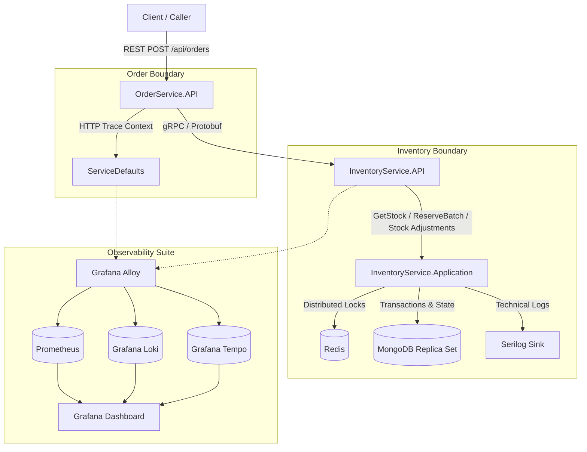
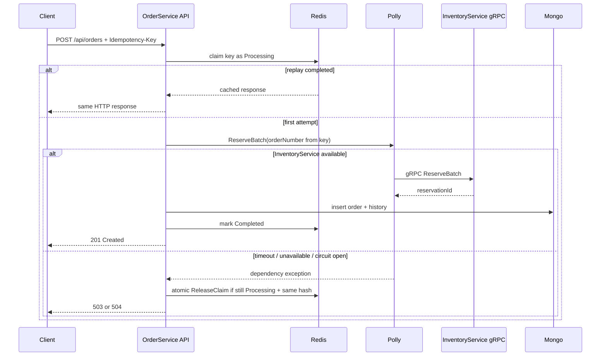

# Inventory Reservation System

An atomic batch-reservation microservice prototype built on **.NET 10**, featuring distributed lock management, transactional consistency, and integrated telemetry.

---

## Overview

In distributed systems, managing inventory reservations across multiple products (SKUs) and warehouses is challenging. Classic databases locks can lead to performance bottlenecks or deadlocks, while optimistic concurrency control can fail under high throughput.

This project implements a **two-service microservices architecture** that handles **atomic batch reservations** using **all-or-nothing** semantics:
- Either all requested items are reserved successfully in the requested quantities.
- Or the entire request fails, leaving stock levels untouched (no partial reservations are permitted).

To prevent concurrency issues and race conditions, the system utilizes a **deterministic distributed lock ordering** pattern in Redis combined with MongoDB transactions.

---

## Architecture & Flow

The system consists of two main services and multiple infrastructure components, structured around clean architecture principles and communicating via gRPC.



### Flow Breakdown
1. **REST Request**: A client submits an order creation payload containing a batch of SKUs, warehouse IDs, and quantities to `OrderService.API` (`POST /api/orders`).
2. **Context Propagation**: `CorrelationId` and W3C trace contexts are generated or extracted from headers and propagated downstream.
3. **Application Use Case**: `OrderService.API` delegates to `OrderService.Application` command/query handlers; endpoints stay thin and do not call repositories directly.
4. **gRPC Delegation**: `OrderService.Infrastructure` implements the inventory reservation abstraction and calls the `InventoryReservations` gRPC service implemented by `InventoryService.API`.
5. **Deterministic Lock Acquisition**: The inventory engine extracts unique keys for each SKU+Warehouse combination, sorts them alphabetically, and acquires locks sequentially from Redis.
6. **Atomic Consistency Check**: Under the protection of the locks, a MongoDB replica-set transaction is opened. The system validates whether all requested stocks exist and are sufficient. If a single SKU is insufficient, the transaction rolls back, all locks are released, and a batch failure is returned.
7. **Audit and Persistence**: If all stocks are valid, stock balances are adjusted, a `Pending` reservation is recorded, audit records are written to `InventoryTransactions`, OrderService persists the order plus `OrderHistory`, and the transactions commit.
8. **Telemetry Tracking**: Telemetry data (logs, metrics, and distributed traces) are automatically collected and shipped via Grafana Alloy to Prometheus, Loki, and Tempo.

---

## Features

### Core Implemented Features
- **Multi-SKU & Multi-Warehouse Aggregated Stock Retrieval (`GetStock`)**: Allows querying stock for a specific SKU at a particular warehouse, or aggregates inventory across all warehouses if the warehouse ID is omitted.
- **Atomic Batch Reservation (`ReserveBatch`)**: All-or-nothing batch reservation engine protected by distributed locks.
- **Idempotent Reservation Release (`ReleaseBatch`)**: Frees reserved inventory back to available stock. Validates against the database-stored reservation state rather than user input to guarantee idempotency.
- **Idempotent Reservation Confirmation (`ConfirmReservation`)**: Converts a pending reservation to a permanent sale. Deducts the reserved count without affecting available stock.
- **Operational Stock Adjustments (`IncreaseStock` / `DecreaseStock`)**: Allows admin/operational corrections for a SKU+warehouse pair under the same Redis lock and MongoDB transaction pattern, writing `AdjustStock` audit records with mandatory reasons.
- **Deterministic Concurrency Control**: Prevents deadlocks under concurrent requests by sorting Redis lock keys lexicographically. Utilizes Polly retry policies for lock acquisition contention.
- **Transactional Audit Trail**: Every stock movement (`Reserve`, `Release`, `Confirm`, etc.) is recorded as an immutable log in the `InventoryTransactions` collection within the same MongoDB transaction.
- **Structured Serilog Logging**: Technical logging with named property templates (no string interpolation) written to both the Console and a dedicated MongoDB `ApplicationLogs` collection.
- **OpenTelemetry Metrics & Health Infrastructure**: Integration with .NET Aspire ServiceDefaults, exposing `/health` (liveness) and `/health/ready` (readiness) endpoints mapped to Mongo and Redis states. InventoryService emits low-cardinality metrics for Redis lock acquisition/ownership, TTL exceeded detection, reservation operation duration/failures, time-to-reserve, time-to-confirmation, and operational stock adjustments.
- **Order Persistence & Lifecycle Endpoints**: OrderService persists created orders and `OrderHistory`, lists/reads orders from MongoDB, and confirms/cancels orders by calling InventoryService through Application-layer use cases.
- **Redis-Based Create-Order Idempotency**: `POST /api/orders` requires a client-generated `Idempotency-Key`. Redis atomically claims the first request, caches the completed HTTP response, replays same-key/same-body retries without MongoDB or gRPC work, rejects same-key/different-body conflicts, and briefly waits for concurrent duplicates to finish.
- **Polly gRPC Resilience & Graceful Degradation**: OrderService calls InventoryService through a shared Polly pipeline with per-attempt timeout, retry, and circuit breaker. When InventoryService is unavailable, slow, or circuit-open, OrderService returns explicit 503/504 responses and does not create a `Pending` order.

### Planned Features (Roadmap)
- **Automatic Expiration Engine**: A background worker that periodically scans for expired `Pending` reservations (10-minute TTL) and releases them, utilizing a MongoDB checkpoint system to resume safely after crashes.
- **Advanced Inventory Workflows**: Multi-warehouse fallback, automated warehouse rebalancing, low-stock alerts, and snapshot/restore utilities.

---

## Resilience & Graceful Degradation

OrderService protects InventoryService gRPC calls with a single shared resilience pipeline:

| Layer | Default | Purpose |
|---|---:|---|
| Timeout | 3 seconds per attempt | Slow gRPC attempts are cut instead of holding the HTTP request forever. |
| Retry | 3 attempts, exponential backoff, 200ms base | Transient gRPC failures get another chance before the API fails. |
| Circuit Breaker | 50% failure ratio, 30s window, 15s break | When InventoryService keeps failing, new calls fail fast with 503 instead of making the outage worse. |

Pipeline order is **Circuit Breaker -> Retry -> Timeout**. Timeout is innermost, so each retry attempt has its own deadline. Circuit breaker is outermost, so it sees the final call outcome after retries.

HTTP mapping:

| Failure | HTTP |
|---|---:|
| Circuit open (`BrokenCircuitException`) | 503 |
| InventoryService unavailable (`RpcException: Unavailable`) | 503 |
| Slow dependency / timeout (`TimeoutRejectedException`, `DeadlineExceeded`, timeout-backed `Cancelled`) | 504 |
| Inventory conflict (`AlreadyExists`, `FailedPrecondition`) | 409 |
| Unexpected downstream gRPC failure | 502 |

Create-order graceful degradation rules:

- InventoryService down, slow, or circuit-open means OrderService returns 503/504.
- OrderService does **not** create a `Pending` order from stale inventory assumptions.
- `Idempotency-Key` deterministically produces the same order number on retry, so timeout retries do not create a new InventoryService reservation identity.
- Transient failure releases the Redis `Processing` claim with a Lua script only if the key is still `Processing` and the request hash still matches. This avoids deleting another request's claim.



---

## Tech Stack

- **Framework**: [.NET 10](https://dotnet.microsoft.com/download/dotnet/10.0) (C# Web API & gRPC)
- **Database**: [MongoDB 8.2](https://www.mongodb.com/) (Configured as a single-node replica set to support multi-document transactions)
- **Caching & Locking**: [Redis 8.8](https://redis.io/) (For high-speed distributed locking via `StackExchange.Redis`)
- **Observability Collectors**: [Grafana Alloy 1.17](https://grafana.com/docs/alloy/latest/)
- **Metrics, Logs & Traces**: [Prometheus 3.7](https://prometheus.io/), [Grafana Loki 3.7](https://grafana.com/oss/loki/), [Grafana Tempo](https://grafana.com/oss/tempo/)
- **Observability UI**: [Grafana 13.0](https://grafana.com/) & [RedisInsight 3.6](https://redis.com/redis-enterprise/redisinsight/)
- **Resilience**: [Polly](https://github.com/App-vNext/Polly) (Redis lock acquisition retries plus OrderService gRPC timeout/retry/circuit breaker pipeline)
- **Logging**: [Serilog](https://serilog.net/) (Structured logging to Console and MongoDB)
- **API Documentation**: [Scalar](https://github.com/scalar/scalar) (REST API Reference playground)

---

## Project Structure

```text
InventoryReservationSystem/
├── InventoryReservationSystem.AppHost/          # .NET Aspire App Host for local orchestration
├── InventoryReservationSystem.ServiceDefaults/  # Shared OpenTelemetry, Health Check & Resilience settings
├── Docs/                                        # Architecture analysis, requirements, and roadmaps
├── src/
│   ├── contracts/
│   │   └── InventoryReservationSystem.Contracts/ # Generated gRPC C# clients and Protobuf contract definitions
│   └── services/
│       ├── InventoryService/
│       │   ├── InventoryService.API/            # Grpc endpoint layer, Serilog config & program bootstrap
│       │   ├── InventoryService.Application/    # Commands/Queries handlers (Reserve, Release, Confirm)
│       │   ├── InventoryService.Domain/         # Business entities, exceptions, and repository interfaces
│       │   └── InventoryService.Infrastructure/  # Mongo repositories, Redis Distributed Lock, Mongo transactions
│       └── OrderService/
│           ├── OrderService.API/                # Thin REST endpoints (/api/orders)
│           ├── OrderService.Application/        # Order lifecycle commands/queries and inventory abstraction
│           ├── OrderService.Domain/             # Order and OrderHistory aggregates
│           └── OrderService.Infrastructure/     # Mongo repositories, transactions, health checks, gRPC adapter
├── test/                                        # Empty (Integration, Unit, and Concurrency tests planned)
├── docker-compose.yml                           # Starts services, databases, replica sets, and telemetry
└── InventoryReservationSystem.slnx              # Modern .NET solution file structure
```

---

## Environment Variables

The default configurations are located in the `appsettings.json` files and are overridden in docker environments using environment variables:

| Variable Name | Service | Default Value | Description |
|---|---|---|---|
| `ASPNETCORE_ENVIRONMENT` | All | `Production` | App run profile (`Development` or `Production`) |
| `ASPNETCORE_URLS` | OrderService | `http://+:8080` | Internal HTTP listening port |
| `InventoryService__Address` | OrderService | `http://inventoryservice-api:8081` | gRPC address of the Inventory service |
| `ConnectionStrings__MongoDb` | OrderService | `mongodb://mongodb:27017/order-service?replicaSet=rs0` | MongoDB Connection String (with ReplicaSet configured) |
| `ConnectionStrings__Redis` | OrderService | `redis:6379` | Redis Host address |
| `ConnectionStrings__MongoDb` | InventoryService | `mongodb://mongodb:27017/inventory-service?replicaSet=rs0` | MongoDB Connection String for inventory |
| `RedisOptions__ConnectionString` | InventoryService | `redis:6379` | Redis lock service connection address |

---

## Getting Started

### Prerequisites
- [.NET 10 SDK](https://dotnet.microsoft.com/download/dotnet/10.0)
- [Docker Desktop](https://www.docker.com/products/docker-desktop/) or any compatible container runtime

### Installation
1. Clone the repository:
   ```bash
   git clone https://github.com/abdulkadirozyurt/InventoryReservationSystem.git
   cd InventoryReservationSystem
   ```

### Running the Application

#### Option A: Docker Compose (Recommended)
This runs the entire stack, including both APIs, databases, telemetry collectors, and visualization panels.

```bash
docker compose up --build
```

**Exposed Ports & Interfaces:**
- **Order Service (REST)**: [http://localhost:5041](http://localhost:5041)
- **Scalar API Reference**: [http://localhost:5041/scalar/v1](http://localhost:5041/scalar/v1)
- **Inventory Service (HTTP Health)**: [http://localhost:5032](http://localhost:5032)
- **Inventory Service (gRPC)**: `localhost:5081`
- **RedisInsight**: [http://localhost:5540](http://localhost:5540)
- **Grafana**: [http://localhost:3000](http://localhost:3000) (Default credentials: `admin` / `admin`)
- **Prometheus**: [http://localhost:9090](http://localhost:9090)
- **MongoDB**: `localhost:27017`

#### Option B: .NET Aspire AppHost (API Orchestration)
If you prefer running only the API services locally and referencing existing external Mongo/Redis instances, use Aspire:

```bash
dotnet run --project InventoryReservationSystem.AppHost/InventoryReservationSystem.AppHost.csproj
```
*Note: The AppHost launches the Aspire Dashboard and starts both C# APIs, but it does not spin up MongoDB or Redis resources; they must be running externally.*

#### Option C: Directly Running Services via CLI
Start the services individually. Ensure your local Redis and MongoDB (Replica Set mode) are running and their connection addresses are updated in `appsettings.json`.

**Inventory Service:**
```bash
dotnet run --project src/services/InventoryService/InventoryService.API/InventoryService.API.csproj
```

**Order Service:**
```bash
dotnet run --project src/services/OrderService/OrderService.API/OrderService.API.csproj
```

---

## Usage

### REST API (OrderService)

#### Create Order Batch Reservation
Submit a batch of items to reserve inventory.

- **Endpoint**: `POST /api/orders`
- **Headers**:
  - `Content-Type: application/json`
  - `Idempotency-Key: <client-generated-unique-value>` (Required; reuse the same value only when retrying the same logical request)
  - `X-Correlation-ID: <unique-guid>` (Optional)
- **Request Body**:
  ```json
  {
    "items": [
      {
        "sku": "SKU-001",
        "warehouseId": "WH-001",
        "quantity": 5
      },
      {
        "sku": "SKU-002",
        "warehouseId": "WH-001",
        "quantity": 2
      }
    ]
  }
  ```

- **Example curl**:
  ```bash
  curl -X POST http://localhost:5041/api/orders \
    -H "Content-Type: application/json" \
    -H "Idempotency-Key: create-order-019f41d43b7176ef9d93820423e24268" \
    -d '{"items":[{"sku":"SKU-001","warehouseId":"WH-001","quantity":5},{"sku":"SKU-002","warehouseId":"WH-001","quantity":2}]}'
  ```

- **Example Response**:
  ```json
  {
    "success": true,
    "orderNumber": "019f41d43b7176ef9d93820423e24268",
    "reservationId": "01908d1a49ab7284b802613d96924bfe",
    "failures": []
  }
  ```

---

### gRPC Contract (InventoryService)

The gRPC API contract is split into five distinct Protobuf files under [src/contracts/InventoryReservationSystem.Contracts/Protos](file:///src/contracts/InventoryReservationSystem.Contracts/Protos/):

1. **`inventory.proto`**: Declares the primary `InventoryReservations` service definition and RPC signatures.
2. **`inventory_common.proto`**: Houses shared models such as `RequestMetadata` (carrying Correlation IDs and Trace headers) and `ReservationFailure` detail structures.
3. **`inventory_reservations.proto`**: Request and response objects for `ReserveBatch`, `ReleaseBatch`, and `ConfirmReservation`.
4. **`inventory_stock.proto`**: Request and response objects for stock lookups (`GetStock`), and stock adjustments (`IncreaseStock`/`DecreaseStock`).
5. **`inventory_operations.proto`**: Placeholders for future operations, including `RebalanceWarehouse` and `CreateInventorySnapshot`.

---

## Tests

The `test/` directory is currently **empty**. 
Comprehensive automated testing is planned for **Phase 6** of the roadmap and will include:
- **Concurrency Integration Tests**: Simulating 100 concurrent requests targeting intersecting SKUs to verify no deadlocks occur and stock allocations remain consistent.
- **Idempotency Verification**: Validating that repeating an idempotency key multiple times returns the same result without duplicate database mutations.
- **Rollback Tests**: Simulating failures mid-transaction to verify MongoDB replica-set rollbacks.
- **Stress Testing**: Using `k6` load scripts to measure system limits, lock contention metrics, and trace performance bottlenecks in Grafana.

---

## What I Learned

During the development of this prototype, several key distributed architecture insights were gained:

1. **Deadlock Prevention in Distributed Locks**: When locking multiple resources (e.g., reserving SKU-A and SKU-B in a single request), acquiring locks in random order will inevitably lead to deadlocks under high concurrency. Sorting the lock keys lexicographically (e.g., `Distinct().Order()`) before making Redis calls ensures a consistent lock acquisition hierarchy, avoiding deadlock situations.
2. **MongoDB Replica Set Requirements**: MongoDB transactions (`IClientSessionHandle`) cannot be executed on standalone instances. They require a Replica Set deployment. A single-node Replica Set (`rs0`) was configured in Docker Compose to enable transactions locally without multi-node overhead.
3. **Idempotent State Management**: Relying on client request inputs for release operations is error-prone. The safest way to release or confirm a reservation is to load the reservation document state directly from MongoDB under a lock, execute the state transition on the server, and verify that the status has not already been changed (e.g., preventing double-refund/double-release).
4. **Alloy Telemetry Collection**: Setting up Grafana Alloy as a local agent provides a clean way to collect traces, logs, and metrics at the host level, separating the application code from direct collection storage logic.

---

## Known Limitations

- **No Automatic Cleanup**: The background worker that expires `Pending` reservations after 10 minutes is defined in the roadmap but has not yet been built. Currently, reservations do not expire automatically.
- **Placeholder Methods**: The advanced operational gRPC operations for rebalancing warehouses and creating/restoring snapshots are currently stubs that return successful response placeholders.
- **No Tests**: Automated tests are missing and will be introduced in the final roadmap phases.

---

## Contributing

This is a personal learning project and is not actively open for major collaborative features. However, feedback and discussions on architectural improvements are always welcome!

To suggest a change:
1. Fork the repository.
2. Create your feature branch (`git checkout -b feature/AmazingFeature`).
3. Commit your changes using conventional commits.
4. Run standard local builds and verify they compile.
5. Open a Pull Request.

---

## License

Distributed under the MIT License. See [LICENCE](./LICENCE) for details.

---

## Contact

**Abdulkadir Özyurt**
- GitHub: [@abdulkadirozyurt](https://github.com/abdulkadirozyurt)
- Project Repository: [InventoryReservationSystem](https://github.com/abdulkadirozyurt/InventoryReservationSystem)
